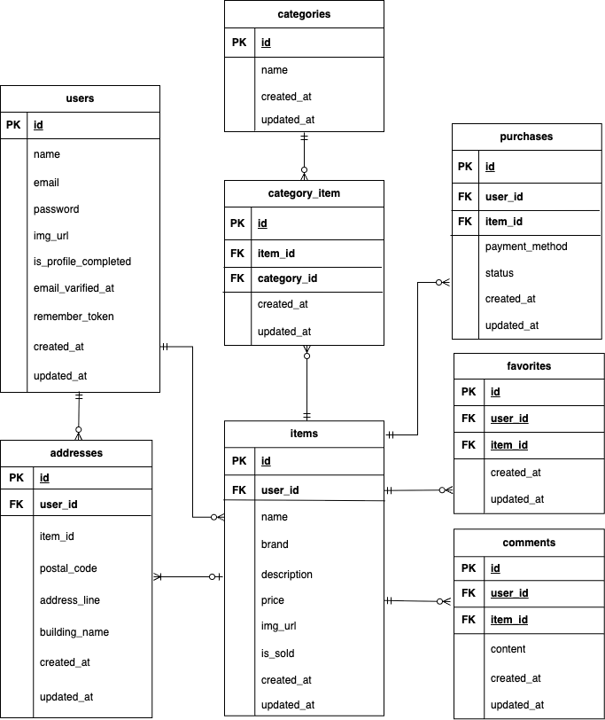

# フリマアプリ

## ER 図



# 環境構築

## Docker ビルド

- `git clone https://github.com/hikaru-jp/furima-coachtech.git`
- `docker-compose up -d --build`

## Laravel 初期設定

- `docker-compose exec php bash`
- `composer install`
- `cp .env.example .env`
- `php artisan key:generate`
- `php artisan migrate`
- `php artisan db:seed`

## 開発環境

- 会員登録：http://localhost/register
- 商品一覧：http://localhost/

# 使用技術（実行環境）

- PHP 8.1
- Laravel 8.83.8
- MySQL 8.0.26

## 決済機能

このアプリでは、Stripe Checkout を使用して応用機能を実装しています。
決済成功後は Laravel 側に戻り、購入処理（住所の紐付け・購入レコード作成・商品状態の更新）が自動で行われます。

### 使用技術

- Stripe Checkout（テストモード）
- success_url → afterStripe 経由で `store()` を内部実行する応用フロー

---

### Stripe API キーの設定

```
STRIPE_SECRET=sk_test_********************************
STRIPE_PUBLIC=pk_test_********************************
```

※ API キーは Stripe ダッシュボード → **開発者 → API キー** から取得できます。

---

### テスト用カード番号（Stripe 公式）

```
カード番号：4242 4242 4242 4242
有効期限：任意の未来日
CVC：任意の3桁
メールアドレス：任意
```

※ テストモードのため、実際に課金はされません。

---

### 購入フロー

1. 購入画面で「購入する」ボタンを押下
2. Stripe Checkout の決済フォームへ遷移
3. テスト決済を実行
4. success_url → `/purchase/{item_id}/after_stripe` へ戻る
5. afterStripe 内で、Laravel の `store()` を内部実行
   - purchases テーブルに購入レコード作成
   - addresses テーブルに item_id が紐付く
   - items テーブルの `is_sold = 1` に更新
6. 処理完了後、商品一覧へリダイレクト

---

### 使用ルート

```
GET     /purchase/{item_id}               purchase.create
POST    /purchase/{item_id}               purchase.store
POST    /purchase/{item_id}/checkout      purchase.checkout
GET     /purchase/{item_id}/after_stripe  purchase.after_stripe
```

---

### 補足

- Stripe に送信されるのは「商品名」と「価格」のみ
- 配送先住所などのユーザー情報は Stripe には送られません
- 住所や購入処理は Laravel 側で実施しています
- テストモードのため、メール保存や「情報を保存する」チェックは無視して問題ないです。
